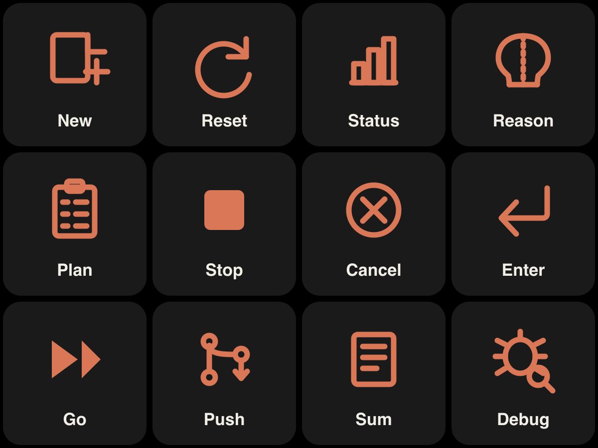

# Stream Deck — Claude CLI Control Profile

A no-code [Elgato Stream Deck](https://www.elgato.com/stream-deck) **profile** to drive
[OpenClaw CLI](https://docs.openclaw.ai) from your deck. Built and verified on a
**Galleon 100 SD** (`GRETSCH`, 4×3 keypad + encoder strip) on macOS.



## What you get

12 keys, each sending a keystroke / text into the focused terminal:

| Key | Action |
|-----|--------|
| 🖥️ Launch | Open Terminal.app |
| ♻️ Reset | `/reset` ⏎ |
| 📊 Status | `/status` ⏎ |
| 🧠 Reason | `/reasoning` ⏎ |
| 📋 Plan | `/plan` ⏎ |
| ⏹️ Stop | `Esc` |
| ❌ Cancel | `Ctrl+C` |
| ⏎ Enter | `Enter` |
| ▶️ Go | types `tiếp tục` ⏎ |
| 🌿 Push | types a commit & push prompt ⏎ |
| ✦ Claude | `claude` ⏎ (start the CLI) |
| 🐞 Debug | types an explain-error prompt ⏎ |

Plus a **Claude sparkle wallpaper** on the LCD (embedded in the profile).

## Install

1. Download `build/Claude CLI.streamDeckProfile`.
2. In the Stream Deck app: profile dropdown ▾ → **Import** → pick the file.
   - On macOS, grant **Accessibility** permission to Stream Deck so the Text actions can type
     (System Settings → Privacy & Security → Accessibility → enable Elgato Stream Deck).

> Usage: click your Terminal window to focus it, then press a key. Press **Launch** to open
> Terminal, then **Claude** to start the CLI.

## Build from source

Requires Node.js and `librsvg` (`brew install librsvg`).

```bash
node gen-icons.js          # 12 button icons (SVG → PNG 288×288)
node gen-wallpaper-720.js  # LCD wallpaper (SVG → PNG 720×384)
node build-profile.js      # assemble + zip → build/Claude CLI.streamDeckProfile
```

## How the profile format works

The importable `.streamDeckProfile` is a zip whose **root** contains `package.json` AND a
`Profiles/` folder (missing the root `package.json` is the #1 reason import silently fails):

```
<zip root>/
├── package.json
└── Profiles/
    └── <UUID>.sdProfile/
        ├── manifest.json            # Device / Name / Pages
        └── Profiles/<PAGE_UUID>/
            ├── manifest.json        # Controllers: Keypad + Encoder
            └── Images/              # button PNGs + wallpaper PNG
```

- Keys are `"row,col"` (Galleon keypad = rows 0–2, cols 0–3).
- The **LCD wallpaper** is `Background` on the **Encoder** controller, a 720×384 PNG.
- Both `Keypad` and `Encoder` controllers must exist for Galleon.
- Action types used: `system.text` (type text + optional Enter), `system.hotkey`
  (key combos), `system.open` (launch app).

## License

MIT
